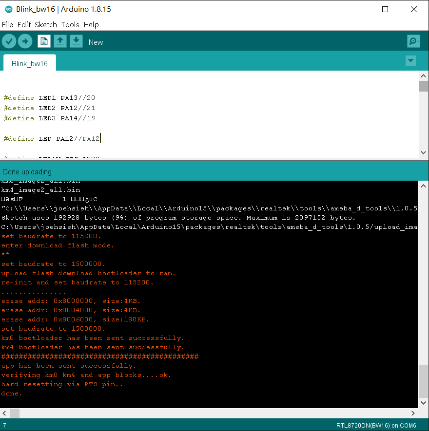
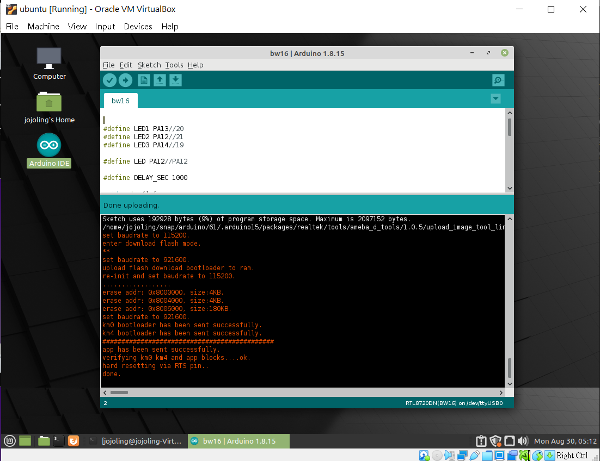
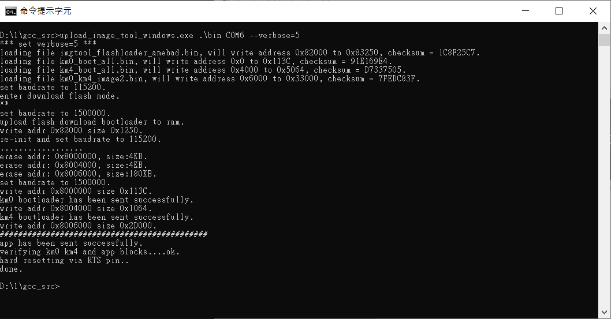
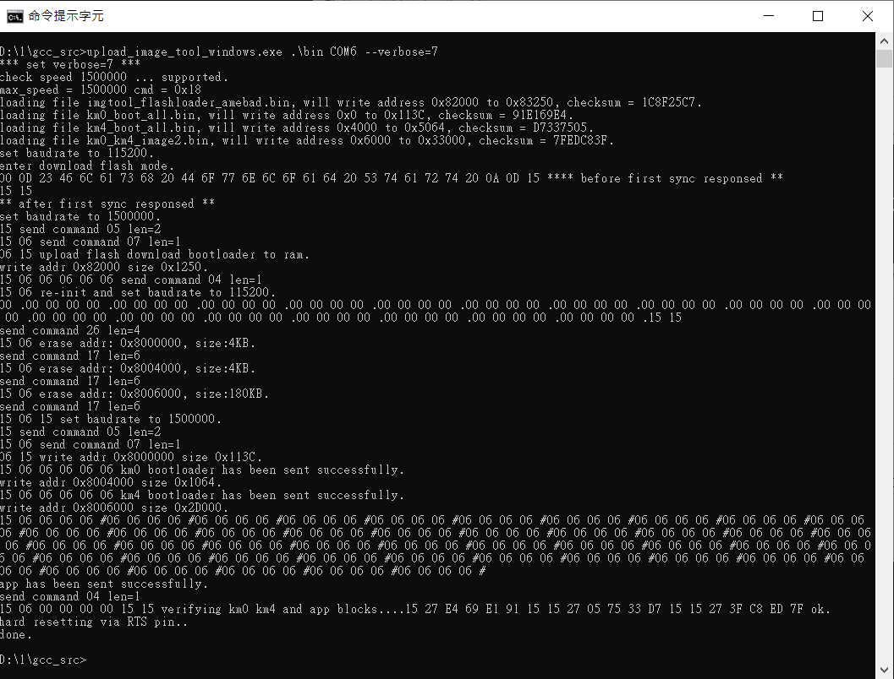
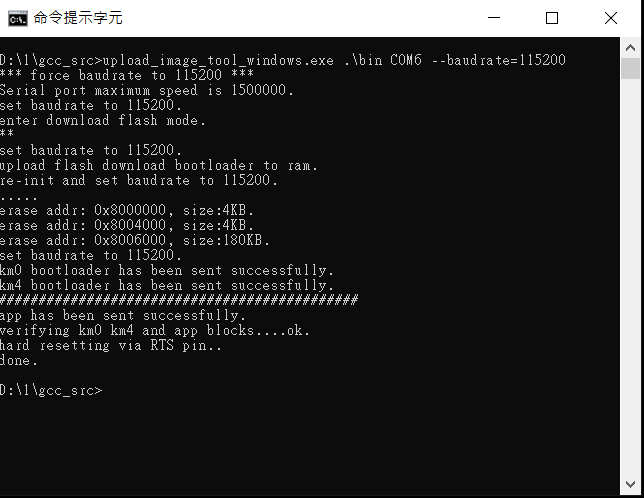

<meta property="og:title" content="RTL8720 autoflash" />
<meta property="og:image" content="https://github.com/jojoling/ameba_bw16_autoflash/blob/main/pic/flash_windows.png" />

# Auto program feature in Arduino Ameba platform.

Here is patched for auto program flash without push BUN and RESET buttons.

v2.2:  
bugs fixed.

v2.0:  
Re-write flash code without calling "amebad_image_tool.exe" (windows/linux/macOS).  
It can update flash correctly without rs232 chip issues.  
  
pass: cp2102/ch340/ft232rl  
platform: Windows 10/ Linux  
macOS: It didn't pass due to macOS VM slowly in my side. It should test on another computer again.  

more command added:  
--verbose=[n] , n can be 3,5 and 7.  
display more information on the screen.  

--baudrate=[speed]  
force rs232 baudrate as you want.  
windows:1500000,1444400,1382400,1000000,921600,500000,460800,380400,230400,380400,128000 and 115200.  
linux:1500000,1000000,921600,500000,460800,230400 and 115200.  
macOS:1500000,1444400,1382400,1000000,921600,500000,460800,380400,230400,380400,128000 and 115200.  

--auto=[0|1]  
enable auto into the flash mode or not.  

v1.0:
Tool only do DTR/RTS control for auto reset function.

# Install ameba
You can reference below link to get started: http://www.amebaiot.com/ameba-arduino-getting-started/

# Patch your environment

* Windows

Download and replace upload_image_tool_windows.exe to your installed folder.  
ex: C:\Users\xxxxxx\AppData\Local\Arduino15\packages\realtek\tools\ameba_d_tools\1.0.5

* Linux

Download and replace upload_image_tool_linux to your installed folder.  
ex: ~/snap/arduino/61/.arduino15/packages/realtek/tools/ameba_d_tools/1.0.5

* MacOS (not test yet)

Download and replace upload_image_tool_macos to your installed folder.  
ex: ~/Library/Arduino15/packages/realtek/tools/ameba_d_tools/1.0.5

# snapshot:
winidows 10:  

linux mint:
cp2102  

verbose = 5  

verbose =7, with recevied packets for debug purpose.  

baudrate=15200, force to low speed 115200 to program flash.  

# Hardware modication:
It needs to add special compoments likes ESP8266/ESP32 auto program circuit.  
nRST => EN , BW16_Pin3  
GPIO0 => LOG_TX ,BW16_Pin11  

# Other infomations:
V2.0:
CP2102 use baudrate 921600 instead of 1000000 for response packets correctly.

All information was retrieved by amebad_image_tool.exe and ImageTool.exe.  
tools used:  
SerialMon,IO ninja, wireshark and tshark.  

V1.0:
Chip CP2012 only supports speed of 1M baudrate. It can't work on RTL8720x uart download flash mode speed 1500000.  
# Known issues
V2.0:
None.

V1.0:
1) First time upload will be failure due to amebad_image_tool.exe(no source) do something and let processor back to normal mode.
   It only happend and just onece in case when usb-serial just plug-in.

#
 Author:Joe Hsieh  
 Email:jojoling@gmail.com  
